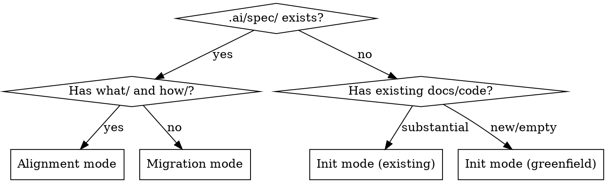
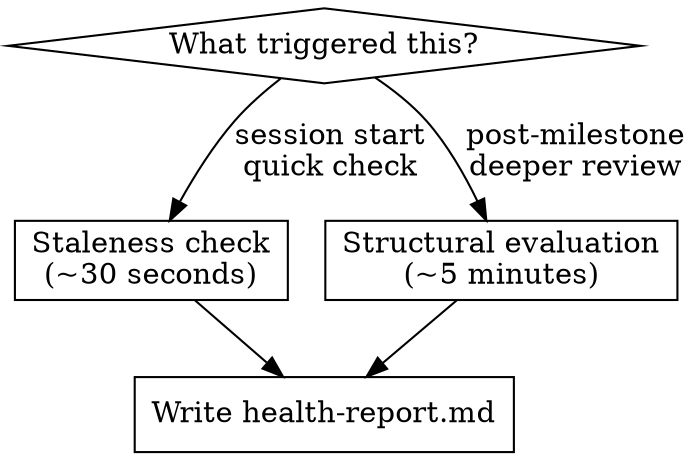

# Software Spec Init Implementation Plan

> **For agentic workers:** REQUIRED SUB-SKILL: Use superpowers:subagent-driven-development (recommended) or superpowers:executing-plans to implement this plan task-by-task. Steps use checkbox (`- [ ]`) syntax for tracking.

**Goal:** Replace the current init skill (designed for book/content projects) with a new init skill optimized for software projects, using a what/how two-layer structure at `.ai/spec/`.

**Architecture:** The current `skills/init/` (with templates) becomes `skills/book-init/`. A new `skills/init/SKILL.md` implements the software-focused init with what/how structure, no template files. The health skill gets updated to recognize both layouts. The verify skill needs a minor update to find specs in `.ai/spec/` in addition to `spec/`.

**Tech Stack:** Claude Code skills (Markdown SKILL.md files), no code dependencies.

---

### Task 1: Rename current init to book-init

Move the existing init skill to `skills/book-init/` and update its SKILL.md frontmatter so it registers under the new name. The templates and all existing behavior remain unchanged.

**Files:**
- Move: `skills/init/` → `skills/book-init/` (entire directory including templates/)
- Modify: `skills/book-init/SKILL.md` (frontmatter only)

- [ ] **Step 1: Move the directory**

```bash
git mv skills/init skills/book-init
```

- [ ] **Step 2: Update SKILL.md frontmatter**

In `skills/book-init/SKILL.md`, change the frontmatter from:

```yaml
---
name: init
description: Use when starting a new project that needs spec structure, or when adopting the spec structure for an existing project with scattered documentation. Also use when asked to set up specs, create project structure, or organize project documentation for AI agent consumption.
---
```

to:

```yaml
---
name: book-init
description: Use when starting a content project (book, documentation, course material) that needs spec structure with features/ and standards/ directories. For software projects, use spec-first:init instead.
---
```

Also update the first heading from `# Spec Init` to `# Spec Init (Content Projects)` and add a note after the first paragraph:

```markdown
> **Software projects:** Use `spec-first:init` instead. This skill creates a features/standards structure optimized for content projects where each deliverable (chapter, article, module) is a self-contained unit of work.
```

- [ ] **Step 3: Verify the move preserved all files**

```bash
ls -la skills/book-init/
ls -la skills/book-init/templates/
```

Expected: SKILL.md plus 6 template files (readme.md, constraints.md, architecture.md, feature.md, glossary.md, decision-record.md).

- [ ] **Step 4: Commit**

```bash
git add skills/book-init/ skills/init/
git commit -m "Rename init to book-init for content projects

Preserves existing features/standards structure for books,
documentation, and other content projects. Software projects
will use the new init skill (next commit)."
```

---

### Task 2: Create the new init SKILL.md for software projects

Create the new `skills/init/SKILL.md` implementing the software spec structure design. No templates directory — the file format conventions are embedded in the SKILL.md as guidance for the agent running the skill.

**Files:**
- Create: `skills/init/SKILL.md`

- [ ] **Step 1: Create the skill file**

Create `skills/init/SKILL.md` with the following content:

```markdown
---
name: init
description: Use when starting a software project that needs spec structure, or when adopting the spec structure for an existing project. Also use when asked to set up specs, create project structure, or organize project documentation for AI agent consumption. Creates a what/how two-layer structure at .ai/spec/.
---

# Spec Init (Software Projects)

Create a standardized spec structure optimized for AI agent comprehension of software projects. The what/how two-layer structure separates behavioral rules (what the system must do) from codebase navigation (how the code is organized). Every file created has real content from what the skill discovers — no empty templates, no placeholder files.

> **Content projects (books, docs, courses):** Use `spec-first:book-init` instead. It creates a features/standards structure where each deliverable is a self-contained unit of work.

**Announce at start:** "I'm using the spec-first:init skill to set up the spec structure."

## Mandatory output

You MUST create exactly these files and directories. Do not create `features/`, `standards/`, or any directories other than `what/`, `how/`, and the optional extensions listed below.

**Required (always create):**
1. `.ai/spec/README.md`
2. `.ai/spec/constraints.md`
3. `.ai/spec/what/system-overview.md`
4. `.ai/spec/how/project-structure.md`
5. `CLAUDE.md` (or update existing one)

**Created from exploration (one or more of each):**
6. `.ai/spec/what/<component>.md` — one file per major component discovered
7. `.ai/spec/how/<concern>.md` — one file per implementation concern discovered

**Optional (create only if content exists for them):**
8. `.ai/spec/glossary.md`
9. `.ai/spec/decisions/` (with NNNN-slug.md files)

Do NOT create `features/`, `standards/`, `architecture.md`, or any other files. Content about the system's architecture goes in `what/system-overview.md` (behavioral rules, integration points) and `how/project-structure.md` (code organization). Coding conventions stay in CLAUDE.md.

## Mode detection



Also check for `spec/` at the project root (the book-init location) — if found, treat as migration mode.

## Init mode: existing codebase

### Step 1: Explore

Read whatever the project has. Check each source, skip what doesn't exist:

**Project files:** README.md, go.mod, package.json, pyproject.toml, Cargo.toml → project name, tech stack, dependencies

**Agent instructions:** CLAUDE.md, AGENTS.md, .cursor/rules/ → existing constraints, conventions

**Documentation:** docs/, .github/ → existing architecture docs, design docs

**Source structure:** directory listing, package layout → component boundaries, architecture clues

**Git history:** `git log --oneline -20` → recent activity, active areas

**Issue tracker:**
- GitHub: `gh issue list --state all --limit 30 --json title,body,labels,state`
- Jira: query via MCP if available
- Other: ask the user if there is a tracker

### Step 2: Infer or ask

**If exploration found context** (existing project): infer what you can, then ask only about what you couldn't determine. Typical questions (skip any you can answer from exploration):
- "What are the non-negotiable rules for this project?" (invariants the code doesn't make obvious)
- "Are there domain-specific terms I should know?"
- "What would surprise an agent working in this codebase?" (hidden coupling, historical decisions, known gotchas)

**If exploration found nothing** (greenfield): structured interview:
1. "What does this project do?"
2. "What tech stack?" (or "not decided yet")
3. "What are the non-negotiable rules?" (or "none yet")
4. "What components do you envision?"
5. "Any domain-specific terms?"

### Step 3: Create .ai/spec/

**Always create:**

`.ai/spec/README.md` — follow this structure:

```markdown
# <Project Name> — Specifications

<One-paragraph description of the project and what these specs cover.>

## Structure

| Layer | Path | Purpose |
|---|---|---|
| **what/** | `.ai/spec/what/` | Behavioral rules. What the system must do. Implementation-agnostic. |
| **how/** | `.ai/spec/how/` | Codebase navigation. How the code is organized. Implementation-specific. |

## Scope

<What's covered. What's out of scope (other repos, external systems).>

## Audience

AI agents. Content is optimized for precision and machine consumption.

## Quick Start

| Task | Start here |
|---|---|
| Understand the system | `what/system-overview.md` |
| <task> | <file(s)> |

## Conventions

- **Rule numbering:** behavioral rules are numbered sequentially within each what/ file.
- **Planned changes:** unimplemented behavior is marked with `[PLANNED]` or `[PLANNED: TICKET-XXXX]` inline next to the rule it affects.
- **Authority:** what/ specs are authoritative for behavior. how/ specs are authoritative for implementation. When they conflict, what/ wins.

## Updating this spec

- **Adding a new component:** create `what/<component>.md` with behavioral rules and `how/<component>.md` with implementation navigation. Add to the quick-start table.
- **Adding rules to an existing component:** append numbered rules to the relevant section in the what/ file. Use `[PLANNED: TICKET]` for unimplemented behavior.
- **After implementation:** remove `[PLANNED]` markers from implemented rules. Update how/ files if code structure changed.
- **When to create a new file vs. extend an existing one:** if the new concern has its own lifecycle, configuration surface, and can be understood independently, it gets its own file. If it's a capability added to an existing component, it goes in that component's file.
```

`.ai/spec/constraints.md` — project-wide invariants from CLAUDE.md, linter configs, CI rules, and user statements. The test for inclusion: if an agent violates this rule, is the system wrong? If yes, it's a constraint. If the system still works but the code is lower quality, it belongs in CLAUDE.md as a convention.

`.ai/spec/what/system-overview.md` — always created first. Follow this structure:

```markdown
# System Overview

<One-paragraph description of what the system is and what it does.>

## Behavioral Rules

### <Section (e.g., System Role, Component Inventory, Lifecycle)>

1. <Testable statement about what the system must do.>
2. <Another testable statement.>

## Configuration Surface

| Field/Flag | Type | Default | Description |
|---|---|---|---|

## Constraints

<System-level constraints. Project-wide constraints go in constraints.md.>

## Planned Changes

| Ticket | Summary |
|---|---|
```

`.ai/spec/what/<component>.md` — one file per major component or cross-cutting concern discovered. Same structure as system-overview.md but focused on one component.

`.ai/spec/how/project-structure.md` — always created first. Follow this structure:

```markdown
# Project Structure

## Module Map

| File/Directory | Key Symbols | Responsibility |
|---|---|---|

## Key Entry Points

<Where execution starts, main files, command handlers.>

## Naming Conventions

<File naming patterns, package organization conventions.>
```

`.ai/spec/how/<concern>.md` — one file per implementation concern. Follow this structure:

```markdown
# <Concern Name>

## Module Map

| File | Key Symbols | Responsibility |
|---|---|---|

## Data Flow

<How data moves through this concern. Call chains, event paths.>

## Key Abstractions

<Patterns, interfaces, design decisions. Why the code is organized this way.>

## Integration Points

| Consumer | Provider | Mechanism |
|---|---|---|

## Implementation Notes

<Gotchas, non-obvious behavior, things that would surprise a reader.>
```

**Conditionally create:**
- `.ai/spec/glossary.md` — only if domain terms found or user provided them
- `.ai/spec/decisions/` — only if existing ADRs found or decisions worth recording

**For greenfield projects:** skip how/ files entirely (no codebase to navigate yet). Create only README.md, constraints.md, and what/ files with behavioral rules from the user's design description.

**Content rules:**
- Every file must have content worth reading. Empty files are not acceptable.
- Do not invent behavioral rules that weren't discovered or stated by the user.
- Do not describe architecture the agent can read from code (directory trees, tech stack from manifest files). The how/ files should explain the WHY behind code organization, non-obvious relationships, and patterns — not restate what `find` can show.
- If a section can't be filled, use a brief prompt describing what goes there — never "TODO" or "TBD".

### Step 4: Update CLAUDE.md (mandatory — do not skip)

If CLAUDE.md exists: add a pointer to `.ai/spec/README.md` under a "## Specs" heading. Don't duplicate spec content.

If CLAUDE.md doesn't exist: create one. This step is not optional — CLAUDE.md is how the agent finds the spec structure:

```markdown
# Project

## Specs

All specifications live in `.ai/spec/`. Start with `.ai/spec/README.md` for project overview, reading order, and structure guide.
```

### Step 5: Commit

```bash
git add .ai/spec/ CLAUDE.md
git commit -m "Initialize spec structure

what/: <list what/ files created>
how/: <list how/ files created>
<list any extensions created>"
```

## Alignment mode

When `.ai/spec/` exists with what/ and how/ directories:

1. **Evaluate** — read all files, check for missing structural elements
2. **Present plan** — show what's missing or misaligned:
   - Missing constraints.md → offer to create
   - Missing README quick-start table → offer to add
   - Missing "Updating this spec" section → offer to add
   - Unnumbered behavioral rules → note as suggestion (don't rewrite)
   - Missing planned markers → note as suggestion
3. **Wait for approval** — do not modify existing files without consent
4. **Execute approved changes** — create missing files, add missing sections
5. **Commit**

## Migration mode

When `.ai/spec/` or `spec/` exists with a non-what/how layout (features/, standards/, etc.):

1. **Inventory** — read all existing spec files
2. **Present migration mapping** — show where each file maps:
   - `architecture.md` → split into `what/system-overview.md` + `how/project-structure.md`
   - `features/<slug>.md` → fold behavioral rules into relevant `what/` files
   - `standards/<file>.md` → move conventions to CLAUDE.md, discard duplicates
   - `constraints.md` → keep as-is (may need to move to `.ai/spec/`)
3. **Wait for approval** — do not create or modify files without consent
4. **Execute migration** — create new what/how files, do not delete originals
5. **User confirms** — only then suggest removing old files
6. **Commit**

## What this skill does NOT do

1. **Duplicate CLAUDE.md/AGENTS.md content.** Build commands, test commands, coding conventions stay where they are.
2. **Describe architecture the agent can read from code.** No file that just lists the directory tree or restates the tech stack from go.mod.
3. **Create feature files.** Work items live in the issue tracker, not in spec files.
4. **Create standards files.** Coding style lives in CLAUDE.md and linter configs.
5. **Invent behavioral rules.** Only capture rules that exist (in code, docs, or user statements).
6. **Overwrite existing spec content without approval.** Always show a plan first.
```

- [ ] **Step 2: Verify the skill file is well-formed**

```bash
head -5 skills/init/SKILL.md
```

Expected: the YAML frontmatter with `name: init` and the updated description.

- [ ] **Step 3: Commit**

```bash
git add skills/init/SKILL.md
git commit -m "Add software-focused init skill with what/how structure

Two-layer spec structure at .ai/spec/:
- what/ for behavioral rules per component
- how/ for codebase navigation per concern
Supports init, alignment, and migration modes."
```

---

### Task 3: Update the health skill to recognize both layouts

The health skill currently hardcodes `spec/` paths and references `spec/features/`, `spec/constraints.md`, `spec/architecture.md`. Update it to handle both the book layout (`spec/`) and the software layout (`.ai/spec/` with what/how).

**Files:**
- Modify: `skills/health/SKILL.md`

- [ ] **Step 1: Update the health skill**

Replace the entire content of `skills/health/SKILL.md` with the following. Key changes:
- Adds a layout detection step at the start
- Replaces hardcoded `spec/` paths with layout-aware paths
- Updates the staleness check to handle what/how files instead of just features/
- Updates the structural evaluation to check what/how boundaries

```markdown
---
name: health
description: Use when starting a session and wanting to check spec freshness, after completing a milestone to evaluate spec structure, or when asked to assess spec health. Reports issues in the spec's health-report.md without modifying spec files.
---

# Spec Health

Evaluate the health of a project's spec structure. Check for stale references, missing context, structural concerns, and findability issues. Report findings in `health-report.md` (overwritten each evaluation) and in conversation.

**Announce at start:** "I'm using the spec-first:health skill to evaluate spec health."

## Layout detection

Before evaluating, determine which spec layout is present:

1. Check for `.ai/spec/what/` — if found, this is the **software layout**. Spec root is `.ai/spec/`.
2. Check for `spec/features/` — if found, this is the **book layout**. Spec root is `spec/`.
3. Check for `spec/README.md` or `.ai/spec/README.md` — use whichever exists as spec root.
4. If neither exists, report "No spec structure found. Run spec-first:init to create one." and stop.

Use `SPEC_ROOT` below to mean whichever root was detected.

## Two evaluation modes



### Staleness check (~30 seconds)

Quick scan for obvious issues. Run at session start or when asked for a quick check.

1. Read `SPEC_ROOT/constraints.md`. Does it reference files, modules, or components that still exist? Check by looking at the codebase.

2. **Software layout:** Read what/ files. Do behavioral rules reference components, modules, or integration points that still exist? Do any `[PLANNED: TICKET]` markers reference tickets that have been completed? Check how/ files — do module maps reference files that still exist?

   **Book layout:** Read `SPEC_ROOT/architecture.md`. Do references still exist? Read feature files in `SPEC_ROOT/features/`. Do any have `depends-on` entries that reference features with status `complete` or features that no longer exist?

3. Check `SPEC_ROOT/health-report.md` timestamp (if it exists). Has the codebase changed significantly since the last evaluation? Run `git log --oneline -10` and compare dates.

4. If issues found: overwrite health-report.md and report. If clean: say "spec health check: no issues found" and move on.

### Structural evaluation (~5 minutes)

Deeper assessment. Run after completing a feature or milestone, or when asked for a thorough evaluation.

Check all of the following:

1. **Findability:** Read the spec structure. Is information organized so an agent can find what it needs? Are related concepts in the same file or scattered across files? Flag anything that required hunting across multiple files.

2. **Completeness:** Are there obvious gaps?
   - **Software layout:** Does each major component in the codebase have a what/ spec? Does each significant implementation pattern have a how/ spec? Are constraints.md rules comprehensive?
   - **Book layout:** Does constraints.md cover the project's actual constraints? Does architecture.md describe the current architecture? Are there features in the codebase with no corresponding spec in features/?

3. **Accuracy:** Does any spec file say something that contradicts the current codebase? Check a sample of claims against the actual code structure. Check that constraints.md rules are still accurate.

4. **Boundaries:** Does any file try to cover too many concerns? Is the same information in two places? Has any file grown large enough that it should be split?
   - **Software layout:** Do what/ and how/ files maintain proper separation (behavioral rules vs. code navigation)? Is any behavioral rule in a how/ file or vice versa?

5. **Structure recommendations:** Based on this evaluation, should any file be split, merged, created, or reorganized? State specific recommendations.

## Output

Overwrite `SPEC_ROOT/health-report.md` (not append — only the latest evaluation matters):

```markdown
# Spec health report

Last evaluated: <date>
Trigger: <staleness-check | post-milestone: feature-name>
Layout: <software (.ai/spec/) | book (spec/)>

## Stale
<references to things that no longer exist, or "none">

## Missing
<context gaps discovered, or "none">

## Structural concerns
<files that cover too many concerns, duplicated info, or "none">

## Findability issues
<information that was hard to locate, or "none">

## No issues
<confirmation of what was checked and found current>
```

Also present findings in conversation.

## What this skill does NOT do

- Does not modify spec files (only reports — human decides whether to act)
- Does not verify content against spec (that's spec-first:verify)
- Does not create spec structure (that's spec-first:init)
- Does not run automatically — user or workflow invokes it
```

- [ ] **Step 2: Verify the update**

```bash
grep -c "SPEC_ROOT" skills/health/SKILL.md
```

Expected: 8 or more occurrences (confirming layout-aware paths throughout).

- [ ] **Step 3: Commit**

```bash
git add skills/health/SKILL.md
git commit -m "Update health skill to recognize both spec layouts

Detects software layout (.ai/spec/ with what/how) and book layout
(spec/ with features/standards). Uses SPEC_ROOT variable for
layout-agnostic evaluation."
```

---

### Task 4: Update the verify skill to find specs in .ai/spec/

The verify skill currently looks for specs in `spec/features/`. It needs to also check `.ai/spec/what/` for software projects.

**Files:**
- Modify: `skills/verify/SKILL.md:18-19`

- [ ] **Step 1: Update the spec location logic**

In `skills/verify/SKILL.md`, find the line:

```markdown
If the user specifies content but not the spec, find the matching spec in `spec/features/`.
```

Replace with:

```markdown
If the user specifies content but not the spec, find the matching spec. Check `.ai/spec/what/` first (software layout), then `spec/features/` (book layout). For software projects, the spec may be spread across multiple what/ files — identify which what/ file contains behavioral rules relevant to the content being verified.
```

Also in Step 1 ("Find four files"), update item 1 from:

```markdown
1. **Feature spec:** the spec in `spec/features/` that corresponds to the content
```

to:

```markdown
1. **Spec file(s):** the spec that corresponds to the content. In software projects (`.ai/spec/what/`), this may be one or more what/ files containing behavioral rules for the component being verified. In book projects (`spec/features/`), this is the feature spec file.
```

And update items 3 and 4 to check both locations:

```markdown
3. **Constraints:** `.ai/spec/constraints.md` or `spec/constraints.md` (whichever exists)
4. **Glossary:** `.ai/spec/glossary.md` or `spec/glossary.md` (whichever exists)
```

- [ ] **Step 2: Update the verification output path**

In Step 3 ("Save and present report"), update:

```markdown
1. Create the directory `spec/verification/` if it doesn't exist: `mkdir -p spec/verification`
2. Save the subagent's verification report to `spec/verification/<slug>-report.md`
```

to:

```markdown
1. Determine the spec root (`.ai/spec/` if it exists, otherwise `spec/`). Create the verification directory if needed: `mkdir -p <spec-root>/verification`
2. Save the subagent's verification report to `<spec-root>/verification/<slug>-report.md`
```

- [ ] **Step 3: Commit**

```bash
git add skills/verify/SKILL.md
git commit -m "Update verify skill to find specs in both layouts

Checks .ai/spec/what/ (software) and spec/features/ (book).
Supports verifying against multiple what/ files for software
projects where specs are component-based, not feature-based."
```

---

### Task 5: Update the plugin README

Update the top-level README.md to describe the new skill landscape: the default init for software, book-init for content, and the two spec structures.

**Files:**
- Modify: `README.md`

- [ ] **Step 1: Rewrite README.md**

Replace the entire content of `README.md` with:

```markdown
# spec-first

Tools to organize project knowledge so AI agents can understand your codebase.

## Skills

This plugin provides skills for the spec lifecycle:

### spec-first:init — Create the spec structure (software)

Scaffolds a spec structure optimized for software projects. Creates a what/how two-layer structure at `.ai/spec/`:
- **what/** — behavioral rules per component (what the system must do)
- **how/** — codebase navigation per concern (how the code is organized)

Three modes:
- **Init:** Creates the structure from an existing codebase or greenfield project
- **Alignment:** Existing what/how specs — fills gaps, suggests improvements
- **Migration:** Existing non-what/how specs — presents a migration plan

### spec-first:book-init — Create the spec structure (content)

Scaffolds a spec structure optimized for content projects (books, documentation, courses). Creates a features/standards structure at `spec/`:
- **features/** — one file per deliverable (chapter, article, module)
- **standards/** — output production rules (style, formatting, terminology)

### spec-first:verify — Verify content against spec

Dispatches an independent agent (with no authoring context) to verify content against its spec. Four verification passes:
1. Acceptance criteria — binary pass/fail for every criterion
2. Constraint compliance — checks every project constraint
3. Term consistency — verifies glossary term usage
4. Internal reference accuracy — checks that references point to real targets

Works with both software (`.ai/spec/`) and book (`spec/`) layouts.

### spec-first:health — Evaluate spec freshness

Checks whether specs are stale, missing information, or structurally unsound. Two modes:
- **Staleness check:** Quick scan for stale references and outdated content
- **Structural evaluation:** Deeper assessment of findability, completeness, accuracy, and boundaries

Works with both software (`.ai/spec/`) and book (`spec/`) layouts.

## Spec structures

### Software projects (default)

```
.ai/spec/
  README.md          — entry point: scope, reading order, update guide
  constraints.md     — project-wide invariants
  glossary.md        — domain terms (optional)
  what/              — behavioral rules per component
    system-overview.md
    <component>.md
  how/               — codebase navigation per concern
    project-structure.md
    <concern>.md
  decisions/         — architecture decision records (optional)
    NNNN-<slug>.md
```

### Content projects

```
spec/
  README.md          — entry point: project description, reading order
  constraints.md     — non-negotiable project rules
  architecture.md    — system structure, boundaries, data flow
  glossary.md        — canonical terms (optional)
  health-report.md   — agent-generated evaluation
  features/          — one file per deliverable
    <slug>.md
  decisions/         — architecture decision records (optional)
    NNNN-<slug>.md
  standards/         — output production rules (optional)
```

## Installation

```bash
claude plugin add joshuawilson/spec-first
```

## Usage

```
/spec-first:init          Set up spec structure for a software project
/spec-first:book-init     Set up spec structure for a content project
/spec-first:verify        Verify content against its spec
/spec-first:health        Check spec freshness and structure
```
```

- [ ] **Step 2: Commit**

```bash
git add README.md
git commit -m "Update README for software-first spec structure

Describes both software (what/how at .ai/spec/) and content
(features/standards at spec/) structures. Documents all four skills."
```

---

### Task 6: Verify all skills are well-formed

Quick verification that all skill files have valid frontmatter and no broken cross-references.

**Files:**
- Read: `skills/init/SKILL.md`, `skills/book-init/SKILL.md`, `skills/health/SKILL.md`, `skills/verify/SKILL.md`

- [ ] **Step 1: Check frontmatter for all skills**

```bash
for skill in skills/*/SKILL.md; do echo "=== $skill ==="; head -4 "$skill"; echo; done
```

Expected:
- `skills/init/SKILL.md` → `name: init`
- `skills/book-init/SKILL.md` → `name: book-init`
- `skills/health/SKILL.md` → `name: health`
- `skills/verify/SKILL.md` → `name: verify`

- [ ] **Step 2: Check for stale cross-references**

```bash
grep -rn "spec-init\|spec-health\|spec-verify" skills/
```

Expected: no references to the old `spec-init`, `spec-health`, or `spec-verify` names. All cross-references should use the plugin-prefixed names (`spec-first:init`, `spec-first:health`, `spec-first:verify`, `spec-first:book-init`).

- [ ] **Step 3: Check for hardcoded spec/ paths in init skill**

```bash
grep -n "spec/" skills/init/SKILL.md | grep -v ".ai/spec/" | grep -v "spec-first" | grep -v "^--"
```

Expected: only references to `spec/` that are in the context of migration mode (detecting book layout at `spec/`). No hardcoded `spec/constraints.md` or `spec/features/` as the primary path.

- [ ] **Step 4: Fix any issues found, then commit if changes were made**

If no issues: skip this step.

If issues found, fix them and:

```bash
git add skills/
git commit -m "Fix cross-references and paths in skill files"
```
