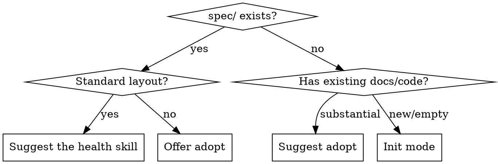

# Spec Init (Content Projects)

Create a standardized spec structure optimized for AI agent comprehension. Every file created has real content from what the skill discovers about the project — no empty templates, no placeholder files.

> **Software projects:** Use the `init` skill instead. This skill creates a features/standards structure optimized for content projects where each deliverable (chapter, article, module) is a self-contained unit of work.

**Announce at start:** "I'm using the spec-first book-init skill to set up the spec structure."

## Mandatory output

Create only the applicable files and directories below. Do not use a different spec structure. Do not create `spec/how/`, `spec/what/`, or any spec subdirectories other than `spec/features/`, `spec/decisions/`, and the optional extension listed below. Agent instruction files at the project root follow Step 4.

**Required (always create):**
1. `spec/README.md`
2. `spec/constraints.md`
3. `spec/architecture.md`
4. `spec/features/` (directory — may be empty)
5. `spec/decisions/README.md` (decision record format and purpose; add NNNN-slug.md records if decisions were found)
6. An agent instruction file pointing to the spec (`AGENTS.md` and/or `CLAUDE.md`; see Step 4)

**Optional (create only if content exists for them):**
7. `spec/glossary.md`
8. `spec/standards/` (with style.md, formatting.md, etc.)

Do NOT create `spec/how/`, `spec/what/`, or any other subdirectories besides `spec/features/`, `spec/decisions/`, and `spec/standards/`. Do NOT create files like `api-design.md`, `coding-standards.md`, `database.md`, or `testing.md` — content about API design goes in `architecture.md`, coding standards go in `constraints.md` or `standards/style.md`. If you find yourself wanting to create an extra file, put that content in one of the mandatory files instead.

## Mode detection



For mode routing, a layout with README.md, constraints.md, architecture.md, and features/ counts as an existing core layout even if it predates the required decisions/ scaffold. A complete standard layout also has `spec/decisions/README.md`. Before suggesting the health skill for an existing layout, check whether `spec/decisions/README.md` exists and whether `AGENTS.md`/`CLAUDE.md` provides a discoverable pointer to `spec/README.md` (directly or via AGENTS.md). If either is missing or stale, show the proposed scaffolding and/or Step 4 changes and **wait for approval** before creating or editing files. Do not force an existing otherwise-standard project through adopt mode just because decisions/ is missing. If the user declines, leave existing files untouched and report the gap. Then suggest the health skill.

## Init mode

### Step 1: Explore

Read whatever the project has. Check each source, skip what doesn't exist:

**Project files:** README.md, package.json, pyproject.toml, Cargo.toml, go.mod → project name, tech stack, dependencies

**Agent instructions:** CLAUDE.md, AGENTS.md, .cursor/rules/ → existing constraints, conventions

**Documentation:** docs/, .github/ → existing architecture docs, design docs, specs

**Source structure:** src/, lib/, directory listing → component boundaries, architecture clues

**Git history:** `git log --oneline -20` → recent activity, active areas

**Issue tracker:**
- GitHub: `gh issue list --state all --limit 30 --json title,body,labels,state`
- Jira: query via MCP if available
- Other: ask the user if there is a tracker

Extract from issues: feature names → seed features/, domain terms → seed glossary, categories → inform architecture

### Step 2: Infer or ask

**If exploration found context** (existing project): infer what you can, then ask only about what you couldn't determine. Typical questions (skip any you can answer from exploration):
- "What does this project do?" (only if README doesn't say)
- "Are there domain-specific terms I should know?"
- "Do you need output standards (style guide, formatting rules)?"

**If exploration found nothing** (new project): structured interview:
1. "What does this project do?"
2. "What tech stack?" (or "not decided yet")
3. "What are the non-negotiable rules?" (or "none yet")
4. "Any domain-specific terms?"
5. "Do you need output standards?"

### Step 3: Create the structure

Read templates from `templates/` in this skill's directory. Replace placeholder markers with discovered content.

**Always create:**
- `spec/README.md` — from templates/readme.md
- `spec/constraints.md` — from templates/constraints.md
- `spec/architecture.md` — from templates/architecture.md
- `spec/features/` — create this directory even if empty (`mkdir -p spec/features`). Populate with feature files from templates/feature.md if features were found during exploration.
- `spec/decisions/README.md` — always create this nonempty, version-controlled scaffold, even when no decisions have been recorded. Explain that decisions use `NNNN-slug.md` and record status, context, decision, and consequences (see templates/decision-record.md). Seed with decision records only if actual decisions were found; never invent them.

**Conditionally create:**
- `spec/glossary.md` — only if domain terms found or user requested
- `spec/standards/` — only if user requested output standards

**Content rules:**
- Every file must have content worth reading
- Empty directories (features/ with no features) are fine. Empty files are not.
- Don't invent content that wasn't discovered or stated
- If a template section can't be filled, replace the placeholder with a brief prompt describing what goes there — never "TODO" or "TBD"
- Remove conditional blocks ({{IF_GLOSSARY}}...{{/IF_GLOSSARY}}) for extensions that aren't being created. Include the required decisions/ entry unconditionally.

### Step 4: Update agent instructions (mandatory — do not skip)

Ensure both Pi and Claude Code can discover the spec entry point without duplicating spec content or replacing existing project instructions:

- If `AGENTS.md` exists, add the spec pointer under a `## Specs` heading (or update its existing pointer). If `CLAUDE.md` also exists, preserve its content and add a pointer to `AGENTS.md` and the spec entry point if not already present. Otherwise create a short `CLAUDE.md` pointing Claude Code to `AGENTS.md` (example below).
- If only `CLAUDE.md` exists, add the spec pointer there under `## Specs`. Pi also reads `CLAUDE.md`; do not create a redundant `AGENTS.md`.
- If neither exists, create `AGENTS.md` with the spec pointer and a small `CLAUDE.md` that tells Claude Code to read `AGENTS.md`. Do not copy the full instructions into both files.

Suggested new `AGENTS.md`:

```markdown
# Project

## Specs

All specifications live in `spec/`. Start with `spec/README.md` for project overview, reading order, and structure guide.
```

Suggested new `CLAUDE.md`:

```markdown
# Project instructions

Read `AGENTS.md` for project instructions and the spec entry point.
```

When modifying an existing file, keep its other instructions intact. If it already contains a spec pointer, update it rather than adding a second one.

### Step 5: Commit only if requested

Check `git status` first. Commit only if the user explicitly requested a commit; otherwise leave the changes for review. Construct a list of **exact file paths** created or modified by this skill, including only the agent instruction files actually changed. Review each file's diff; if a file also contains the user's unrelated changes, ask how to separate them before committing. Never use a directory-wide path or unrestricted `git commit` here: unrelated work may already be staged.

When a commit was requested, stage exactly those paths and use a path-limited commit so previously staged unrelated files remain outside it:

```bash
# Example paths only: replace with the exact files changed in this run.
paths=(spec/README.md spec/constraints.md spec/architecture.md spec/decisions/README.md AGENTS.md CLAUDE.md)
git status
git add -- "${paths[@]}"
git commit --only -m "Initialize spec structure" -- "${paths[@]}"
```

Include any feature or extension files explicitly; omit nonexistent or unchanged example paths. An empty `spec/features/` cannot be committed by Git until it contains a file.

## Adopt mode

### Step 1: Inventory

Same exploration as init mode, but focus on finding existing documentation to migrate: CLAUDE.md constraints, docs/ files, existing specs/PRDs/design docs, ADRs, issue tracker.

### Step 2: Present migration plan

Show the user what was found and where it maps. Example:

> I found these existing documents. Here's where each one maps:
> - Agent instruction file constraints section → spec/constraints.md
> - docs/architecture.md → spec/architecture.md
> - docs/webhook-spec.md → spec/features/webhook-registration.md
> - No glossary found — skip
> - No ADRs found — create decisions/README.md as required scaffolding, but no decision records
>
> Approve before I create anything?

**Wait for approval.** Do not create files until the user confirms the mapping.

### Step 3: Create the structure

Same as init step 3, but content comes from existing documents following the approved mapping.

**Do not delete original files.** Leave them until the user confirms the new structure works.

### Step 4: Update agent instructions; commit only if requested

Include missing or stale instruction pointers in the approved adoption plan. Update only after approval, following init steps 4-5.

## Target structure

```
spec/
  README.md              — entry point: project description, reading order
  constraints.md         — non-negotiable project rules
  architecture.md        — system structure, boundaries, data flow
  glossary.md            — canonical terms (optional)
  features/              — one file per feature
    <slug>.md            — lowercase, hyphenated, descriptive
  decisions/             — required decision record scaffold
    README.md            — format and purpose
    NNNN-<slug>.md        — actual decisions (when found)
  standards/             — EXTENSION: output production rules
```

health-report.md is created by the health skill, not by this skill.
