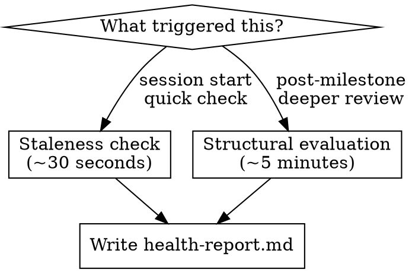

# Spec Health

Evaluate the health of a project's spec structure. Check for stale references, missing context, structural concerns, and findability issues. Report findings in `spec/health-report.md` (overwritten each evaluation) and in conversation.

**Announce at start:** "I'm using the spec-first:health skill to evaluate spec health."

## Two evaluation modes



### Staleness check (~30 seconds)

Quick scan for obvious issues. Run at session start or when asked for a quick check.

1. Read `spec/constraints.md` and `spec/architecture.md`. Do they reference files, modules, or components that still exist? Check by looking at the codebase.
2. Read feature files in `spec/features/`. Do any have `depends-on` entries that reference features with status `complete` or features that no longer exist?
3. Check `spec/health-report.md` timestamp (if it exists). Has the codebase changed significantly since the last evaluation? Run `git log --oneline -10` and compare dates.
4. If issues found: overwrite health-report.md and report. If clean: say "spec health check: no issues found" and move on.

### Structural evaluation (~5 minutes)

Deeper assessment. Run after completing a feature or milestone, or when asked for a thorough evaluation.

Check all of the following:

1. **Findability:** Read the spec structure. Is information organized so an agent can find what it needs? Are related concepts in the same file or scattered across files? Flag anything that required hunting across multiple files.

2. **Completeness:** Are there obvious gaps? Does constraints.md cover the project's actual constraints? Does architecture.md describe the current architecture? Are there features in the codebase with no corresponding spec in features/?

3. **Accuracy:** Does any spec file say something that contradicts the current codebase? Check a sample of claims in architecture.md against the actual code structure. Check that constraints.md rules are still accurate.

4. **Boundaries:** Does any file try to cover too many concerns? Is the same information in two places? Has any file grown large enough that it should be split?

5. **Structure recommendations:** Based on this evaluation, should any file be split, merged, created, or reorganized? State specific recommendations.

## Output

Overwrite `spec/health-report.md` (not append — only the latest evaluation matters):

```markdown
# Spec health report

Last evaluated: <date>
Trigger: <staleness-check | post-milestone: feature-name>

## Stale
<references to things that no longer exist, or "none">

## Missing
<context gaps discovered, or "none">

## Structural concerns
<files that cover too many concerns, duplicated info, or "none">

## Findability issues
<information that was hard to locate, or "none">

## No issues
<confirmation of what was checked and found current>
```

Also present findings in conversation.

## What this skill does NOT do

- Does not modify spec files (only reports — human decides whether to act)
- Does not verify content against spec (that's spec-first:verify)
- Does not create spec structure (that's spec-first:init)
- Does not run automatically — user or workflow invokes it
