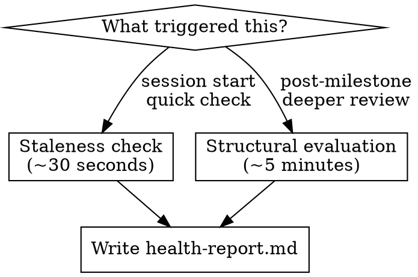

# Spec Health

Evaluate the health of a project's spec structure. Check for stale references, missing context, structural concerns, and findability issues. Report findings in `health-report.md` (overwritten each evaluation) and in conversation.

**Announce at start:** "I'm using the spec-first health skill to evaluate spec health."

## Layout detection

Before evaluating, determine which spec layout is present:

1. Check for `.ai/spec/what/` — if found, this is the **software layout**. Spec root is `.ai/spec/`.
2. Check for `spec/features/` — if found, this is the **book layout**. Spec root is `spec/`.
3. Check for `spec/README.md` or `.ai/spec/README.md` — use whichever exists as spec root.
4. If neither exists, report "No spec structure found. Run the init skill to create one." and stop.

Use `SPEC_ROOT` below to mean whichever root was detected.

## Two evaluation modes


```dot
digraph health {
    "What triggered this?" [shape=diamond];
    "Staleness check\n(~30 seconds)" [shape=box];
    "Structural evaluation\n(~5 minutes)" [shape=box];
    "Write health-report.md" [shape=box];

    "What triggered this?" -> "Staleness check\n(~30 seconds)" [label="session start\nquick check"];
    "What triggered this?" -> "Structural evaluation\n(~5 minutes)" [label="post-milestone\ndeeper review"];
    "Staleness check\n(~30 seconds)" -> "Write health-report.md";
    "Structural evaluation\n(~5 minutes)" -> "Write health-report.md";
}
```

### Staleness check (~30 seconds)

Quick scan for obvious issues. Run at session start or when asked for a quick check.

1. **Software layout:** Read what/ files, including the Constraints sections in each. Check:
   - Do behavioral rules reference components, modules, or integration points that still exist?
   - Do any `[PLANNED: TICKET]` markers reference tickets that have been completed? (Check tracker if accessible.)
   - Are there `[PLANNED]` markers with no ticket reference?
   - Are there `[DONE: TICKET]` markers that should be cleaned up? (Rule text should already reflect shipped behavior — the marker is noise.)
   - Check how/ files — do module maps reference files that still exist? Do key symbols named in module maps still exist in the codebase? (`grep` for them.)
   - Are there spec files with no git activity while the source code they describe has changed significantly? (`git log --since` on spec file vs related source paths.)

   **Book layout:** Read `SPEC_ROOT/constraints.md` and `SPEC_ROOT/architecture.md`. Do references still exist? Check that `SPEC_ROOT/decisions/README.md` exists (the required decision record scaffold). Read feature files in `SPEC_ROOT/features/`. Do any have `depends-on` entries that reference features with status `complete` or features that no longer exist?

2. Check `SPEC_ROOT/health-report.md` timestamp (if it exists). Has the codebase changed significantly since the last evaluation? Run `git log --oneline -10` and compare dates.

3. If issues found: overwrite health-report.md and report. If clean: say "spec health check: no issues found" and move on.

### Structural evaluation (~5 minutes)

Deeper assessment. Run after completing a feature or milestone, or when asked for a thorough evaluation.

Check all of the following:

1. **Findability:** Read the spec structure. Is information organized so an agent can find what it needs? Are related concepts in the same file or scattered across files? Flag anything that required hunting across multiple files.

2. **Completeness:** Are there obvious gaps?
   - **Software layout:** Does each major component in the codebase have a what/ spec? Does each significant implementation pattern have a how/ spec? Do what/ files have Constraints sections where applicable? Does a `decisions/` directory exist? (It should — init always creates it as scaffolding for capturing architectural decisions over time.) Does `ARCHITECTURE.md` exist at the project root? Are there cross-cutting rules scattered across what/ files that should be in `constraints.md`?
   - **Book layout:** Does constraints.md cover the project's actual constraints? Does architecture.md describe the current architecture? Does the required `decisions/README.md` exist? Are there features in the codebase with no corresponding spec in features/?
   - **Multi-repo:** If this is a parent workspace with child repos, does `how/` contain a routing index (repo-map)? Is it complete — does every child repo with specs appear in it?

3. **Accuracy:** Does any spec file say something that contradicts the current codebase? Check a sample of claims (behavioral rules, constraints, module maps) against the actual code structure. For how/ files, verify that module map entries (files, key symbols, responsibilities) match the current codebase.

4. **Boundaries:** Does any file try to cover too many concerns? Is the same information in two places? Has any file grown large enough that it should be split?
   - **Software layout:** Do what/ and how/ files maintain proper separation? what/ files contain system contracts (behavioral rules, APIs, data formats, configuration surface) without referencing code locations. how/ files contain the codebase map (file layout, call graphs, patterns) without prescribing behavior. Is any behavioral rule in a how/ file or vice versa?

5. **Lifecycle hygiene:**
   - **Rule numbering:** Are behavioral rules numbered sequentially with stable identifiers? Are there unexplained gaps that might indicate removed rules worth noting?
   - **[PLANNED] markers:** Do all `[PLANNED]` markers have ticket references? Are any referencing completed tickets?
   - **[DONE] markers:** Are there `[DONE: TICKET]` markers where the rule text already reflects shipped behavior? These are cleanup candidates.
   - **Planned Changes tables:** Are there struck-through entries (`~~TICKET~~`) that are old enough to remove?

6. **Structure recommendations:** Based on this evaluation, should any file be split, merged, created, or reorganized? State specific recommendations.

## Output

Overwrite `SPEC_ROOT/health-report.md` (not append — only the latest evaluation matters):

```markdown
# Spec health report

Last evaluated: <date>
Trigger: <staleness-check | post-milestone: feature-name>
Layout: <software (.ai/spec/) | book (spec/)>

## Stale
<references to things that no longer exist, dead symbols in module maps, or "none">

## Missing
<context gaps: unspecced components, missing decisions/, missing ARCHITECTURE.md, or "none">

## Lifecycle
<[DONE] markers to clean up, [PLANNED] markers with completed tickets, stale planned changes table entries, or "none">

## Structural concerns
<files that cover too many concerns, duplicated info, boundary violations, or "none">

## Findability issues
<information that was hard to locate, or "none">

## No issues
<confirmation of what was checked and found current>
```

Also present findings in conversation.

## What this skill does NOT do

- Does not modify spec files (only reports — human decides whether to act)
- Does not verify content against spec (that's the verify skill)
- Does not create spec structure (that's the init skill)
- Does not run automatically — user or workflow invokes it
