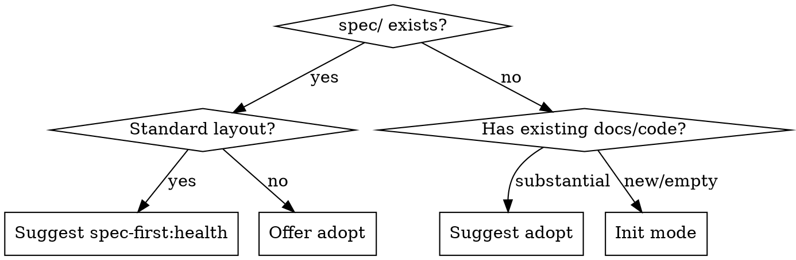

# Spec Init

Create a standardized spec structure optimized for AI agent comprehension. Every file created has real content from what the skill discovers about the project — no empty templates, no placeholder files.

**Announce at start:** "I'm using the spec-first:init skill to set up the spec structure."

## Mandatory output

You MUST create exactly these files and directories. Do not create other files. Do not use a different structure. Do not create `spec/how/`, `spec/what/`, or any subdirectories other than `spec/features/` and the optional extensions listed below.

**Required (always create):**
1. `spec/README.md`
2. `spec/constraints.md`
3. `spec/architecture.md`
4. `spec/features/` (directory — may be empty)
5. `CLAUDE.md` (or update existing one)

**Optional (create only if content exists for them):**
6. `spec/glossary.md`
7. `spec/decisions/` (with NNNN-slug.md files)
8. `spec/standards/` (with style.md, formatting.md, etc.)

Do NOT create `spec/how/`, `spec/what/`, or any other subdirectories besides `spec/features/`, `spec/decisions/`, and `spec/standards/`. Do NOT create files like `api-design.md`, `coding-standards.md`, `database.md`, or `testing.md` — content about API design goes in `architecture.md`, coding standards go in `constraints.md` or `standards/style.md`. If you find yourself wanting to create an extra file, put that content in one of the mandatory files instead.

## Mode detection



Standard layout means: spec/ contains README.md, constraints.md, architecture.md, and features/.

## Init mode

### Step 1: Explore

Read whatever the project has. Check each source, skip what doesn't exist:

**Project files:** README.md, package.json, pyproject.toml, Cargo.toml, go.mod → project name, tech stack, dependencies

**Agent instructions:** CLAUDE.md, AGENTS.md, .cursor/rules/ → existing constraints, conventions

**Documentation:** docs/, .github/ → existing architecture docs, design docs, specs

**Source structure:** src/, lib/, directory listing → component boundaries, architecture clues

**Git history:** `git log --oneline -20` → recent activity, active areas

**Issue tracker:**
- GitHub: `gh issue list --state all --limit 30 --json title,body,labels,state`
- Jira: query via MCP if available
- Other: ask the user if there is a tracker

Extract from issues: feature names → seed features/, domain terms → seed glossary, categories → inform architecture

### Step 2: Infer or ask

**If exploration found context** (existing project): infer what you can, then ask only about what you couldn't determine. Typical questions (skip any you can answer from exploration):
- "What does this project do?" (only if README doesn't say)
- "Are there domain-specific terms I should know?"
- "Do you need output standards (style guide, formatting rules)?"

**If exploration found nothing** (new project): structured interview:
1. "What does this project do?"
2. "What tech stack?" (or "not decided yet")
3. "What are the non-negotiable rules?" (or "none yet")
4. "Any domain-specific terms?"
5. "Do you need output standards?"

### Step 3: Create the structure

Read templates from `templates/` in this skill's directory. Replace placeholder markers with discovered content.

**Always create:**
- `spec/README.md` — from templates/readme.md
- `spec/constraints.md` — from templates/constraints.md
- `spec/architecture.md` — from templates/architecture.md
- `spec/features/` — create this directory even if empty (`mkdir -p spec/features`). Populate with feature files from templates/feature.md if features were found during exploration.

**Conditionally create:**
- `spec/glossary.md` — only if domain terms found or user requested
- `spec/decisions/` — only if ADRs found or decisions worth recording
- `spec/standards/` — only if user requested output standards

**Content rules:**
- Every file must have content worth reading
- Empty directories (features/ with no features) are fine. Empty files are not.
- Don't invent content that wasn't discovered or stated
- If a template section can't be filled, replace the placeholder with a brief prompt describing what goes there — never "TODO" or "TBD"
- Remove conditional blocks ({{IF_GLOSSARY}}...{{/IF_GLOSSARY}}) for extensions that aren't being created

### Step 4: Update CLAUDE.md (mandatory — do not skip)

If CLAUDE.md exists: add a pointer to `spec/README.md` under a "## Specs" heading. Don't duplicate spec content.

If CLAUDE.md doesn't exist: create one. This step is not optional — CLAUDE.md is how the agent finds the spec structure:

```markdown
# Project

## Specs

All specifications live in `spec/`. Start with `spec/README.md` for project overview, reading order, and structure guide.
```

### Step 5: Commit

```bash
git add spec/ CLAUDE.md
git commit -m "Initialize spec structure

Core: README.md, constraints.md, architecture.md, features/
[list any extensions created]"
```

## Adopt mode

### Step 1: Inventory

Same exploration as init mode, but focus on finding existing documentation to migrate: CLAUDE.md constraints, docs/ files, existing specs/PRDs/design docs, ADRs, issue tracker.

### Step 2: Present migration plan

Show the user what was found and where it maps. Example:

> I found these existing documents. Here's where each one maps:
> - CLAUDE.md constraints section → spec/constraints.md
> - docs/architecture.md → spec/architecture.md
> - docs/webhook-spec.md → spec/features/webhook-registration.md
> - No glossary found — skip
> - No ADRs found — skip decisions/
>
> Approve before I create anything?

**Wait for approval.** Do not create files until the user confirms the mapping.

### Step 3: Create the structure

Same as init step 3, but content comes from existing documents following the approved mapping.

**Do not delete original files.** Leave them until the user confirms the new structure works.

### Step 4: Update CLAUDE.md and commit

Same as init steps 4-5.

## Target structure

```
spec/
  README.md              — entry point: project description, reading order
  constraints.md         — non-negotiable project rules
  architecture.md        — system structure, boundaries, data flow
  glossary.md            — canonical terms (optional)
  features/              — one file per feature
    <slug>.md            — lowercase, hyphenated, descriptive
  decisions/             — EXTENSION: architecture decision records
    NNNN-<slug>.md
  standards/             — EXTENSION: output production rules
```

health-report.md is created by the spec-first:health skill, not by this skill.
