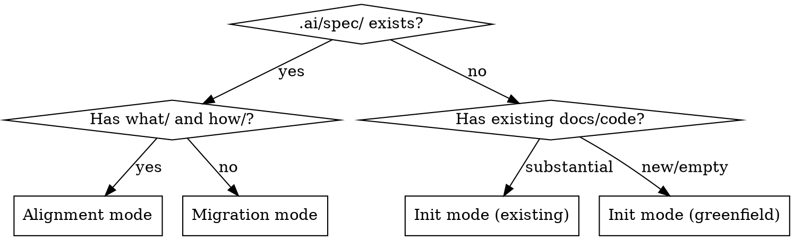

# Spec Init (Software Projects)

Create a standardized spec structure optimized for AI agent comprehension of software projects. The what/how two-layer structure separates behavioral rules (what the system must do) from codebase navigation (how the code is organized). Every file created has real content from what the skill discovers — no empty templates, no placeholder files.

> **Content projects (books, docs, courses):** Use `spec-first:book-init` instead. It creates a features/standards structure where each deliverable is a self-contained unit of work.

**Announce at start:** "I'm using the spec-first:init skill to set up the spec structure."

## Mandatory output

You MUST create exactly these files and directories. Do not create `features/`, `standards/`, or any directories other than `what/`, `how/`, and the optional extensions listed below.

**Required (always create):**
1. `.ai/spec/README.md`
2. `.ai/spec/what/system-overview.md`
3. `.ai/spec/how/project-structure.md`
4. `CLAUDE.md` (or update existing one)
5. `ARCHITECTURE.md` at the project root (human-facing, not agent context)

**Created from exploration (one or more of each):**
6. `.ai/spec/what/<component>.md` — one file per major component discovered
7. `.ai/spec/how/<concern>.md` — one file per implementation concern discovered

**Optional (create only if content exists for them):**
8. `.ai/spec/glossary.md`
9. `.ai/spec/decisions/` (with NNNN-slug.md files)

Do NOT create `features/`, `standards/`, `constraints.md`, `what/README.md`, `how/README.md`, or any other files. Component-specific and cross-cutting constraints go in the relevant what/ file's Constraints section — co-located with the behavioral rules that give them context. Development conventions (build commands, test commands, coding style) stay in CLAUDE.md. Content about the system's architecture goes in `what/system-overview.md` (behavioral rules, integration points) and `how/project-structure.md` (code organization).

## Mode detection



Also check for `spec/` at the project root (the book-init location) — if found, treat as migration mode.

## Init mode: existing codebase

### Step 1: Explore

Read whatever the project has. Check each source, skip what doesn't exist:

**Project files:** README.md, go.mod, package.json, pyproject.toml, Cargo.toml → project name, tech stack, dependencies

**Agent instructions:** CLAUDE.md, AGENTS.md, .cursor/rules/ → existing constraints, conventions

**Documentation:** docs/, .github/ → existing architecture docs, design docs

**Source structure:** directory listing, package layout → component boundaries, architecture clues

**Git history:** `git log --oneline -20` → recent activity, active areas

**Issue tracker:**
- GitHub: `gh issue list --state all --limit 30 --json title,body,labels,state`
- Jira: query via MCP if available
- Other: ask the user if there is a tracker

### Step 2: Infer or ask

**If exploration found context** (existing project): infer what you can, then ask only about what you couldn't determine. Typical questions (skip any you can answer from exploration):
- "What are the non-negotiable rules for this project?" (invariants the code doesn't make obvious)
- "Are there domain-specific terms I should know?"
- "What would surprise an agent working in this codebase?" (hidden coupling, historical decisions, known gotchas)

**If exploration found nothing** (greenfield): structured interview:
1. "What does this project do?"
2. "What tech stack?" (or "not decided yet")
3. "What are the non-negotiable rules?" (or "none yet")
4. "What components do you envision?"
5. "Any domain-specific terms?"

### Step 3: Create .ai/spec/

**Always create:**

`.ai/spec/README.md` — follow this structure:

```markdown
# <Project Name> — Specifications

<One-paragraph description of the project and what these specs cover.>

## Structure

| Layer | Path | Purpose |
|---|---|---|
| **what/** | `.ai/spec/what/` | Behavioral rules. What the system must do. Implementation-agnostic. |
| **how/** | `.ai/spec/how/` | Codebase navigation. How the code is organized. Implementation-specific. |

## Scope

<What's covered. What's out of scope (other repos, external systems).>

## Audience

AI agents. Content is optimized for precision and machine consumption.

## Quick Start

| Task | Start here |
|---|---|
| Understand the system | `what/system-overview.md` |
| <task> | <file(s)> |

## Cross-Reference

When what/ and how/ file names don't match 1:1, this table maps behavioral specs to their implementation guides:

| what/ | how/ |
|---|---|
| <what/file.md> | <how/file.md> |

## Conventions

- **Rule numbering:** behavioral rules are numbered sequentially within each what/ file.
- **Planned changes:** unimplemented behavior is marked with `[PLANNED]` or `[PLANNED: TICKET-XXXX]` inline next to the rule it affects.
- **Constraints:** component-specific and cross-cutting constraints go in the relevant what/ file's Constraints section, co-located with behavioral rules. Development conventions go in CLAUDE.md.
- **Authority:** what/ specs are authoritative for behavior. how/ specs are authoritative for implementation. When they conflict, what/ wins.
- **When to create a new file vs. extend an existing one:** if the new concern has its own lifecycle, configuration surface, and can be understood independently, it gets its own file. If it's a capability added to an existing component, it goes in that component's file.
```

`.ai/spec/what/system-overview.md` — always created first. Follow this structure:

```markdown
# System Overview

<One-paragraph description of what the system is and what it does.>

## Behavioral Rules

### <Section (e.g., System Role, Component Inventory, Lifecycle)>

1. <Testable statement about what the system must do.>
2. <Another testable statement.>

## Configuration Surface

| Field/Flag | Type | Default | Description |
|---|---|---|---|

## Constraints

<System-level constraints. Project-wide constraints go in constraints.md.>

## Planned Changes

| Ticket | Summary |
|---|---|
```

`.ai/spec/what/<component>.md` — one file per major component or cross-cutting concern discovered. Same structure as system-overview.md but focused on one component.

`.ai/spec/how/project-structure.md` — always created first. Follow this structure:

```markdown
# Project Structure

## Module Map

| File/Directory | Key Symbols | Responsibility |
|---|---|---|

## Key Entry Points

<Where execution starts, main files, command handlers.>

## Naming Conventions

<File naming patterns, package organization conventions.>
```

`.ai/spec/how/<concern>.md` — one file per implementation concern. Follow this structure:

```markdown
# <Concern Name>

## Module Map

| File | Key Symbols | Responsibility |
|---|---|---|

## Data Flow

<How data moves through this concern. Call chains, event paths.>

## Key Abstractions

<Patterns, interfaces, design decisions. Why the code is organized this way.>

## Integration Points

| Consumer | Provider | Mechanism |
|---|---|---|

## Implementation Notes

<Gotchas, non-obvious behavior, things that would surprise a reader.>
```

`ARCHITECTURE.md` at the project root — a human-facing overview of the system's architecture. This is NOT agent context (agents use `.ai/spec/`). It is a document for human developers joining the project or returning after time away. You already have the context from exploring the codebase — write this at the same time as the spec files.

Content should include:
- **Prose overview** of what the system does and how it's structured, written for a human reader
- **Diagrams** using Mermaid fenced code blocks (` ```mermaid `) to visualize:
  - System component relationships and boundaries
  - Data flow or request flow through the system
  - Deployment topology (if applicable)
  - Any other structural relationships that are easier to understand visually than in prose
- **Key architectural decisions** summarized in prose (not the full ADR — just enough context for orientation)

Prefer diagrams over long prose descriptions wherever a visual would communicate the structure more clearly. A component diagram with labeled arrows tells a human more in 10 seconds than three paragraphs of description.

If the project already has an `ARCHITECTURE.md`, update it rather than overwriting — it may contain human-curated content worth preserving. Present changes for approval.

**Conditionally create:**
- `.ai/spec/glossary.md` — only if domain terms found or user provided them
- `.ai/spec/decisions/` — only if existing ADRs found or decisions worth recording

**For greenfield projects:** skip how/ files and `ARCHITECTURE.md` (no codebase to describe yet). Create only README.md and what/ files with behavioral rules from the user's design description.

**Content rules:**
- Every file must have content worth reading. Empty files are not acceptable.
- Do not invent behavioral rules that weren't discovered or stated by the user.
- Do not describe architecture the agent can read from code (directory trees, tech stack from manifest files). The how/ files should explain the WHY behind code organization, non-obvious relationships, and patterns — not restate what `find` can show.
- If a section can't be filled, use a brief prompt describing what goes there — never "TODO" or "TBD".

### Step 4: Update CLAUDE.md (mandatory — do not skip)

If CLAUDE.md exists: add a pointer to `.ai/spec/README.md` under a "## Specs" heading. Don't duplicate spec content.

If CLAUDE.md doesn't exist: create one. This step is not optional — CLAUDE.md is how the agent finds the spec structure:

```markdown
# Project

## Specs

All specifications live in `.ai/spec/`. Start with `.ai/spec/README.md` for project overview, reading order, and structure guide.
```

### Step 5: Commit

```bash
git add .ai/spec/ CLAUDE.md ARCHITECTURE.md
git commit -m "Initialize spec structure

what/: <list what/ files created>
how/: <list how/ files created>
<list any extensions created>"
```

## Alignment mode

When `.ai/spec/` exists with what/ and how/ directories:

1. **Evaluate** — read all files, check for missing structural elements
2. **Present plan** — show what's missing or misaligned:
   - Missing README quick-start table → offer to add
   - Missing cross-reference table → offer to add
   - Unnumbered behavioral rules → note as suggestion (don't rewrite)
   - Missing planned markers → note as suggestion
   - Missing Constraints section in what/ files → note as suggestion
3. **Wait for approval** — do not modify existing files without consent
4. **Execute approved changes** — create missing files, add missing sections
5. **Commit**

## Migration mode

When `.ai/spec/` or `spec/` exists with a non-what/how layout (features/, standards/, etc.):

1. **Inventory** — read all existing spec files
2. **Present migration mapping** — show where each file maps:
   - `architecture.md` → split into `what/system-overview.md` + `how/project-structure.md`
   - `features/<slug>.md` → fold behavioral rules into relevant `what/` files
   - `standards/<file>.md` → move conventions to CLAUDE.md, discard duplicates
   - `constraints.md` → distribute rules into relevant what/ file Constraints sections
3. **Wait for approval** — do not create or modify files without consent
4. **Execute migration** — create new what/how files, do not delete originals
5. **User confirms** — only then suggest removing old files
6. **Commit**

## What this skill does NOT do

1. **Duplicate CLAUDE.md/AGENTS.md content.** Build commands, test commands, coding conventions stay where they are.
2. **Describe architecture the agent can read from code.** No file that just lists the directory tree or restates the tech stack from go.mod.
3. **Create feature files.** Work items live in the issue tracker, not in spec files.
4. **Create standards files.** Coding style lives in CLAUDE.md and linter configs.
5. **Invent behavioral rules.** Only capture rules that exist (in code, docs, or user statements).
6. **Overwrite existing spec content without approval.** Always show a plan first.
