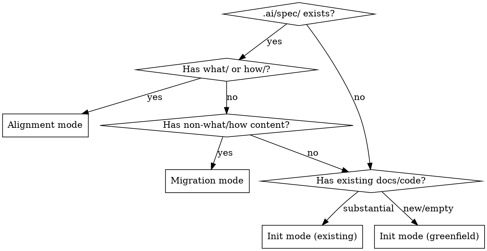

# Spec Init (Software Projects)

Create a standardized spec structure optimized for AI agent comprehension of software projects. The what/how two-layer structure separates the system's contracts (what the system must do, its APIs, data formats, and configuration) from the codebase map (where code lives, call graphs, patterns, and abstractions). Every file created has real content from what the skill discovers — no empty templates, no placeholder files.

> **Content projects (books, docs, courses):** Use `spec-first:book-init` instead. It creates a features/standards structure where each deliverable is a self-contained unit of work.

**Announce at start:** "I'm using the spec-first:init skill to set up the spec structure."

## Mandatory output

`.ai/spec/` is committed to version control — it is shared project context, not local scratch. Generated outputs (health reports, verification reports) may be gitignored at the team's discretion.

You MUST create exactly these files and directories. Do not create `features/`, `standards/`, or any directories other than `what/`, `how/`, and the optional extensions listed below.

**Required (always create):**
1. `.ai/spec/README.md`
2. `.ai/spec/what/system-overview.md`
3. `.ai/spec/how/project-structure.md`
4. `CLAUDE.md` (or update existing one)
5. `ARCHITECTURE.md` at the project root (human-facing, not agent context)

**Created from exploration (one or more of each):**
6. `.ai/spec/what/<component>.md` — one file per major component discovered
7. `.ai/spec/how/<concern>.md` — one file per implementation concern discovered

**Always create (scaffolding — content accumulates over time):**
8. `.ai/spec/decisions/` — create with a README.md explaining the format (NNNN-slug.md). Architectural decisions happen from day one; the directory must exist so they get captured. Seed with any decisions discovered during exploration.

**Optional (create only if content exists for them):**
9. `.ai/spec/glossary.md`
10. `.ai/spec/constraints.md` — only if cross-cutting rules exist that span multiple components and don't belong in any single what/ file (e.g., git workflow rules, shared namespace conventions, API group standards)

Do NOT create `features/`, `standards/`, `what/README.md`, `how/README.md`, or any other files. Component-specific constraints go in the relevant what/ file's Constraints section — co-located with the behavioral rules that give them context. Cross-cutting rules that span the whole project (git workflow, shared conventions, namespace standards) may go in `constraints.md` if they don't belong to any single component. Development conventions (build commands, test commands, coding style) stay in CLAUDE.md. Content about the system's architecture goes in `what/system-overview.md` (behavioral rules, integration points) and `how/project-structure.md` (code organization).

## what/ vs how/ boundary

The test: **would this content change if the codebase were rewritten in a different language but the system's external behavior stayed the same?** If no → what/. If yes → how/.

- **what/** contains: behavioral rules, API endpoints, CRD schemas, env var names, configuration fields, data format contracts, integration contracts, constraints. These are specific and technical — "implementation-agnostic" does not mean abstract. It means the content describes the system's contracts without referencing which files or functions implement them.
- **how/** contains: module maps (file → symbols → responsibility), call graphs, data flow through code, design patterns used, key abstractions, integration points between code modules, implementation gotchas. This content is tied to the current codebase structure.
- **Configuration Surface** belongs in what/ — it's part of the behavioral contract (what the system accepts and what the defaults are), not a code detail.
- **SDK/library names** in what/ files: avoid when possible, but acceptable when the behavioral rule is inherently per-library (e.g., adapter contracts for specific SDKs).

## Mode detection


```dot
digraph mode {
    ".ai/spec/ exists?" [shape=diamond];
    "Has what/ or how/?" [shape=diamond];
    "Has non-what/how content?" [shape=diamond];
    "Has existing docs/code?" [shape=diamond];
    "Alignment mode" [shape=box];
    "Migration mode" [shape=box];
    "Init mode (existing)" [shape=box];
    "Init mode (greenfield)" [shape=box];

    ".ai/spec/ exists?" -> "Has what/ or how/?" [label="yes"];
    ".ai/spec/ exists?" -> "Has existing docs/code?" [label="no"];
    "Has what/ or how/?" -> "Alignment mode" [label="yes"];
    "Has what/ or how/?" -> "Has non-what/how content?" [label="no"];
    "Has non-what/how content?" -> "Migration mode" [label="yes"];
    "Has non-what/how content?" -> "Has existing docs/code?" [label="no"];
    "Has existing docs/code?" -> "Init mode (existing)" [label="substantial"];
    "Has existing docs/code?" -> "Init mode (greenfield)" [label="new/empty"];
}
```

The key check is `what/ OR how/` (not AND) — a greenfield project that grew may have `what/` without `how/`. Alignment mode handles this by detecting the missing layer and offering to create it. "Non-what/how content" means `features/`, `standards/`, or other spec files in a layout that needs migration. An empty `.ai/spec/` or one with only a README.md falls through to init mode. Also check for `spec/` at the project root (the book-init location) — if found, treat as migration mode.

**Re-runs are safe.** Running this skill again on an already-initialized project routes to alignment mode, which only acts on missing or misaligned elements — it never overwrites existing content.

## Multi-repo and monorepo projects

When a workspace contains multiple repos or a monorepo contains multiple services, use a layered spec structure:

- **Parent level** (workspace root or monorepo root): `.ai/spec/` covers cross-repo/cross-service concerns. what/ files describe end-to-end flows that span boundaries. how/ contains a routing index (e.g., `repo-map.md`) mapping concerns to repos/packages and their spec files — not a code map.
- **Child level** (each repo or service directory): its own `.ai/spec/` with repo-specific what/ and how/ files.
- **Authority:** child specs are authoritative for internal behavior. Parent specs are authoritative for cross-boundary integration contracts. State this in the parent README.md.
- **No duplication:** parent specs describe how components interact, not what each component does internally. If a behavioral rule applies to only one repo, it goes in that repo's spec.

Run init separately at each level. The parent init should discover child repos/services and create the routing index.

## Init mode: existing codebase

### Step 1: Explore

Read whatever the project has. Check each source, skip what doesn't exist:

**Project files:** README.md, go.mod, package.json, pyproject.toml, Cargo.toml → project name, tech stack, dependencies

**Agent instructions:** CLAUDE.md, AGENTS.md, .cursor/rules/ → existing constraints, conventions

**Documentation:** docs/, .github/ → existing architecture docs, design docs

**Source structure:** directory listing, package layout → component boundaries, architecture clues

**Git history:** `git log --oneline -20` → recent activity, active areas

**Issue tracker:**
- GitHub: `gh issue list --state all --limit 30 --json title,body,labels,state`
- Jira: query via MCP if available
- Other: ask the user if there is a tracker

### Step 2: Infer or ask

**If exploration found context** (existing project): infer what you can, then ask only about what you couldn't determine. Typical questions (skip any you can answer from exploration):
- "What are the non-negotiable rules for this project?" (invariants the code doesn't make obvious)
- "Are there domain-specific terms I should know?"
- "What would surprise an agent working in this codebase?" (hidden coupling, historical decisions, known gotchas)

**If exploration found nothing** (greenfield): structured interview. Note that greenfield answers are inherently speculative — the resulting what/ files are drafts that should be revised once real implementation begins.
1. "What does this project do?"
2. "What tech stack?" (or "not decided yet")
3. "What are the non-negotiable rules?" (or "none yet")
4. "What components do you envision?"
5. "Any domain-specific terms?"

### Step 3: Create .ai/spec/

**Always create:**

`.ai/spec/README.md` — follow this structure:

```markdown
# <Project Name> — Specifications

<One-paragraph description of the project and what these specs cover.>

## Structure

| Layer | Path | Purpose |
|---|---|---|
| **what/** | `.ai/spec/what/` | System contracts. What the system must do — behavioral rules, APIs, data formats, configuration surface. |
| **how/** | `.ai/spec/how/` | Codebase map. How the code is organized — file layout, call graphs, patterns, key abstractions. |

## Scope

<What's covered. What's out of scope (other repos, external systems).>

## Audience

AI agents. Content is optimized for precision and machine consumption.

## Quick Start

| Task | Start here |
|---|---|
| Understand the system | `what/system-overview.md` |
| <task> | <file(s)> |

## Cross-Reference

When what/ and how/ file names don't match 1:1, this table maps behavioral specs to their implementation guides:

| what/ | how/ |
|---|---|
| <what/file.md> | <how/file.md> |

## Conventions

- **Rule numbering:** behavioral rules are numbered sequentially within each what/ file. Numbers are stable identifiers — do not renumber when a rule is removed (leave a gap) or inserted (use sub-numbers like 16a, 16b). This keeps external references (Jira comments, PR descriptions) valid.
- **Planned changes lifecycle:** unimplemented behavior is marked `[PLANNED]` or `[PLANNED: TICKET-XXXX]` inline next to the rule it affects. When implemented: update the rule text to describe actual behavior and change the marker to `[DONE: TICKET-XXXX]`. `[DONE]` markers are cleanup candidates — remove them in a subsequent pass once the rule text fully reflects the shipped behavior. In Planned Changes tables, strike through completed entries (`~~TICKET~~`) rather than deleting them, so readers can see what changed recently.
- **Constraints:** component-specific constraints go in the relevant what/ file's Constraints section, co-located with behavioral rules. Cross-cutting project-wide rules (git workflow, namespace conventions) may go in `constraints.md`. Development conventions go in CLAUDE.md.
- **Authority:** what/ specs are authoritative for behavior. how/ specs are authoritative for implementation. When they conflict, what/ wins.
- **When to create a new file vs. extend an existing one:** if the new concern has its own lifecycle, configuration surface, and can be understood independently, it gets its own file. If it's a capability added to an existing component, it goes in that component's file.
```

`.ai/spec/what/system-overview.md` — always created first. Follow this structure:

```markdown
# System Overview

<One-paragraph description of what the system is and what it does.>

## Behavioral Rules

### <Section (e.g., System Role, Component Inventory, Lifecycle)>

1. <Testable statement about what the system must do.>
2. <Another testable statement.>

## Configuration Surface

- `<field.path>` — <what it controls>

## Constraints

<System-level constraints. Project-wide constraints go in constraints.md.>

## Planned Changes

| Ticket | Summary |
|---|---|
```

`.ai/spec/what/<component>.md` — one file per major component or cross-cutting concern discovered. Same structure as system-overview.md but focused on one component.

`.ai/spec/how/project-structure.md` — always created first. Follow this structure:

```markdown
# Project Structure

## Module Map

| File/Directory | Key Symbols | Responsibility |
|---|---|---|

## Key Entry Points

<Where execution starts, main files, command handlers.>

## Naming Conventions

<File naming patterns, package organization conventions.>
```

`.ai/spec/how/<concern>.md` — one file per implementation concern. Follow this structure:

```markdown
# <Concern Name>

## Module Map

| File | Key Symbols | Responsibility |
|---|---|---|

## Data Flow

<How data moves through this concern. Call chains, event paths.>

## Key Abstractions

<Patterns, interfaces, design decisions. Why the code is organized this way.>

## Integration Points

| Consumer | Provider | Mechanism |
|---|---|---|

## Implementation Notes

<Gotchas, non-obvious behavior, things that would surprise a reader.>
```

`ARCHITECTURE.md` at the project root — a human-facing overview of the system's architecture. This complements but does not duplicate the spec: specs have numbered rules and structured tables for agents; ARCHITECTURE.md has prose narrative and diagrams (Mermaid) for humans. Both are written from the same exploration pass. You already have the context from exploring the codebase — write this at the same time as the spec files.

Content should include:
- **Prose overview** of what the system does and how it's structured, written for a human reader
- **Diagrams** using Mermaid fenced code blocks (` ```mermaid `) to visualize:
  - System component relationships and boundaries
  - Data flow or request flow through the system
  - Deployment topology (if applicable)
  - Any other structural relationships that are easier to understand visually than in prose
- **Key architectural decisions** summarized in prose (not the full ADR — just enough context for orientation)

Prefer diagrams over long prose descriptions wherever a visual would communicate the structure more clearly. A component diagram with labeled arrows tells a human more in 10 seconds than three paragraphs of description.

If the project already has an `ARCHITECTURE.md`, update it rather than overwriting — it may contain human-curated content worth preserving. Present changes for approval.

**Conditionally create:**
- `.ai/spec/glossary.md` — only if domain terms found or user provided them

**For greenfield projects:** skip how/ files and `ARCHITECTURE.md` (no codebase to describe yet). Create only README.md and what/ files with behavioral rules from the user's design description. Re-run init after the first meaningful implementation — the mode detection will route to alignment mode, which will detect the missing how/ layer and ARCHITECTURE.md and offer to create them from the now-existing codebase.

**Content rules:**
- Every file must have content worth reading. Empty files are not acceptable.
- Do not invent behavioral rules that weren't discovered or stated by the user.
- how/ files should curate, not enumerate. A Module Map that identifies which files matter, names key symbols, and explains each file's role is valuable — a raw directory tree or tech stack restated from a manifest file is not. The test: does this save the agent meaningful exploration time, or could `find`/`grep` produce the same information in seconds?
- If a section can't be filled, omit it. Empty sections cost the reader tokens and provide no information. A missing section is honest — the content either doesn't exist or wasn't discovered.

### Step 4: Update CLAUDE.md (mandatory — do not skip)

If CLAUDE.md exists: add a pointer to `.ai/spec/README.md` under a "## Specs" heading. Don't duplicate spec content.

If CLAUDE.md doesn't exist: create one. This step is not optional — CLAUDE.md is how the agent finds the spec structure:

```markdown
# Project

## Specs

All specifications live in `.ai/spec/`. Start with `.ai/spec/README.md` for project overview, reading order, and structure guide.
```

### Step 5: Commit

Check `git status` first. If there are unrelated staged or modified files (especially CLAUDE.md or ARCHITECTURE.md with pre-existing uncommitted edits), stash or separate them before committing. Only stage files created or modified by this skill.

```bash
git status
git add .ai/spec/ CLAUDE.md ARCHITECTURE.md
git commit -m "Initialize spec structure

what/: <list what/ files created>
how/: <list how/ files created>
<list any extensions created>"
```

## Alignment mode

When `.ai/spec/` exists with what/ or how/ directories (or both). Typical triggers: the skill has been updated and existing specs need structural conformance, the codebase has grown and new components lack spec files, or a greenfield project now has code and needs its how/ layer and ARCHITECTURE.md.

1. **Evaluate** — read all files, check for missing structural elements
2. **Present plan** — show what's missing or misaligned:
   - Missing README quick-start table → offer to add
   - Missing cross-reference table → offer to add
   - Layer READMEs exist (`what/README.md`, `how/README.md`) → absorb their spec indexes and cross-reference tables into the main README, then suggest removing them
   - Unnumbered behavioral rules → note as suggestion (don't rewrite)
   - Missing planned markers → note as suggestion
   - Missing Constraints section in what/ files → note as suggestion
   - ARCHITECTURE.md missing or stale (compare against spec content) → offer to create or update
   - Codebase components without corresponding what/ or how/ files → offer to create
3. **Wait for approval** — do not modify existing files without consent
4. **Execute approved changes** — create missing files, add missing sections
5. **Commit**

For content staleness checking (spec drift from code), use `spec-first:health` instead.

## Migration mode

When `.ai/spec/` or `spec/` exists with a non-what/how layout (features/, standards/, etc.):

1. **Inventory** — read all existing spec files
2. **Present migration mapping** — show where each file maps:
   - `architecture.md` → split into `what/system-overview.md` + `how/project-structure.md`
   - `features/<slug>.md` → fold behavioral rules into relevant `what/` files
   - `standards/<file>.md` → move conventions to CLAUDE.md, discard duplicates
   - `constraints.md` → component-specific rules go into relevant what/ file Constraints sections; cross-cutting project-wide rules stay in `constraints.md`
3. **Wait for approval** — do not create or modify files without consent
4. **Execute migration** — create new what/how files, do not delete originals
5. **User confirms** — only then suggest removing old files. If the user declines, add a note to README.md stating that `what/` and `how/` are authoritative and the old structure is retained for reference only.
6. **Commit**

## What this skill does NOT do

1. **Duplicate CLAUDE.md/AGENTS.md content.** Build commands, test commands, coding conventions stay where they are.
2. **Enumerate what `find`/`grep` can show.** No file that just lists the directory tree or restates the tech stack from a manifest. Curated module maps with key symbols and responsibilities are fine — raw enumeration is not.
3. **Create feature files.** Work items live in the issue tracker, not in spec files.
4. **Create standards files.** Coding style lives in CLAUDE.md and linter configs.
5. **Invent behavioral rules.** Only capture rules that exist (in code, docs, or user statements).
6. **Overwrite existing spec content without approval.** Always show a plan first.
